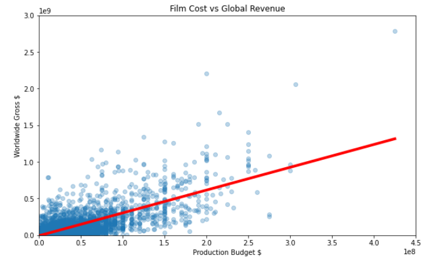

# Predict Movie Box Office Revenue with Linear Regression

The question here is : *Can we use movie budgets to predict movie revenue?*
## Preview

## Tools
- Python 3+
- Librairies: Pandas, Matplotlib, Scikit-learn
- Jupyter Notebook

***
## Jupyter Notebook

The Jupyter notebook is a web-based notebook environment for interactive
computing.

### Installation
You can find the installation documentation for the
[Jupyter platform, on ReadTheDocs](https://jupyter.readthedocs.io/en/latest/install.html).
The documentation for advanced usage of Jupyter notebook can be found
[here](https://jupyter-notebook.readthedocs.io/en/latest/).

For a local installation, make sure you have
[pip installed](https://pip.readthedocs.io/en/stable/installing/) and run:

    $ pip install notebook

### Usage - Running Jupyter notebook

Launch with:

    $ jupyter notebook

## Resources
- [Project Jupyter website](https://jupyter.org)
- [Online Demo at jupyter.org/try](https://jupyter.org/try)
- [Documentation for Jupyter notebook](https://jupyter-notebook.readthedocs.io/en/latest/) [[PDF](https://media.readthedocs.org/pdf/jupyter-notebook/latest/jupyter-notebook.pdf)]
- [Korean Version of Installation](https://github.com/ChungJooHo/Jupyter_Kor_doc/)
- [Documentation for Project Jupyter](https://jupyter.readthedocs.io/en/latest/index.html) [[PDF](https://media.readthedocs.org/pdf/jupyter/latest/jupyter.pdf)]
- [Issues](https://github.com/jupyter/notebook/issues)
- [Technical support - Jupyter Google Group](https://groups.google.com/forum/#!forum/jupyter)
***

